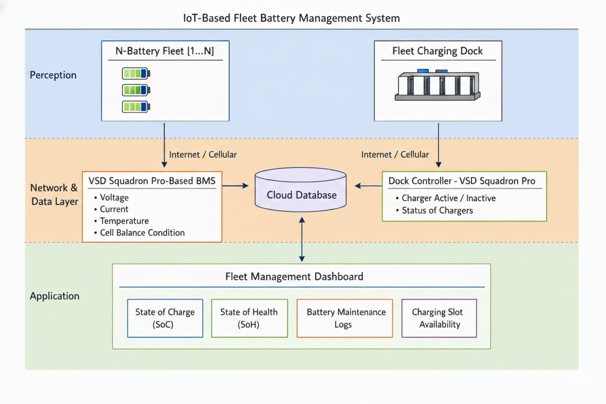

# Fleet Vision BMS - System Architecture

## IoT-Based Fleet Battery Management System

This document describes the complete system architecture of the Fleet Vision BMS, designed as a three-layer IoT solution for electric vehicle fleet management.

## Architecture Overview



The system follows a standard IoT architecture with three distinct layers:

### 1. Perception Layer (Physical Layer)

The perception layer consists of physical devices that collect data from the environment.

#### N-Battery Fleet [1...N]
- Multiple electric vehicles equipped with BMS units
- Each vehicle has independent monitoring
- Real-time data collection from battery packs
- GPS location tracking
- Autonomous operation capability

#### VSD Squadron Pro-Based BMS
Each vehicle is equipped with a BMS unit that monitors:
- **Voltage**: Individual cell voltages (3 cells)
- **Current**: Bidirectional current sensing (charging/discharging)
- **Temperature**: Multi-point temperature monitoring (3 sensors)
- **Cell Balance Condition**: Voltage imbalance detection

#### Fleet Charging Dock
Centralized charging infrastructure with:
- Multiple charging slots
- Intelligent slot management
- Status monitoring for each charger
- Active/Inactive charger control

#### Dock Controller (VSD Squadron Pro)
Manages the charging infrastructure:
- **Charger Active/Inactive**: Control individual chargers
- **Status of Chargers**: Monitor charging progress
- **Slot Availability**: Real-time slot status
- **Queue Management**: Optimize charging schedule

### 2. Network & Data Layer (Communication Layer)

The network layer handles data transmission and storage.

#### Internet/Cellular Connectivity
- **Bidirectional Communication**: Vehicle ↔ Cloud ↔ Dock
- **Protocols**: HTTP/HTTPS, MQTT (optional)
- **Data Format**: JSON
- **Security**: TLS/SSL encryption

#### Cloud Database
Centralized data storage and processing:
- **Real-time Telemetry**: Live data from all vehicles
- **Historical Data**: Time-series storage
- **Analytics**: Aggregated fleet statistics
- **ML Processing**: Anomaly detection and predictions

#### Data Transmission Flow
```
Vehicle BMS → Internet/Cellular → Cloud Database
     ↓                                ↓
  Sensors                        Processing
     ↓                                ↓
Battery Metrics              ML Models + Storage
GPS Location                       ↓
Fault Status                  REST API
                                   ↓
Charging Dock → Internet/Cellular → Cloud Database
     ↓                                ↓
Charger Status                 Processing
Slot Availability                   ↓
                              Dashboard
```

### 3. Application Layer (User Interface Layer)

The application layer provides user interfaces and business logic.

#### Fleet Management Dashboard
Web-based control center with four main modules:

##### 1. State of Charge (SoC)
- Real-time battery levels for all vehicles
- Historical SoC trends
- Charging predictions
- Range estimation

##### 2. State of Health (SoH)
- Battery degradation tracking
- Capacity fade analysis
- Cycle count monitoring
- Predictive maintenance alerts

##### 3. Battery Maintenance Logs
- Service history
- Fault records
- Maintenance schedules
- Repair tracking
- Cost analysis

##### 4. Charging Slot Availability
- Real-time dock status
- Available slots
- Queue management
- Booking system
- Estimated wait times

## Detailed Component Breakdown

### Perception Layer Components

| Component | Function | Data Generated |
|-----------|----------|----------------|
| **Voltage Sensors** | Monitor cell voltages | V1, V2, V3 (cumulative) |
| **Temperature Sensors** | Monitor cell temperatures | T1, T2, T3 (°C) |
| **Current Sensor** | Measure charge/discharge current | I (A, ±4A range) |
| **GPS Module** | Track vehicle location | Lat, Lon, Speed, Altitude |
| **Environmental Sensor** | Monitor ambient conditions | Temperature, Pressure |
| **OLED Display** | Local status display | 6-page cycling display |
| **Status LEDs** | Visual indicators | Charging, Discharging, Fault |
| **Relay** | Safety cutoff | Power control |
| **Buzzer** | Audible alarms | Fault alerts |

### Network Layer Components

| Component | Function | Technology |
|-----------|----------|------------|
| **ESP8266 WiFi** | Wireless connectivity | 802.11 b/g/n |
| **Cellular Module** | Mobile connectivity | 4G/LTE (optional) |
| **Cloud Server** | Backend processing | Flask/Python |
| **Database** | Data storage | SQLite/PostgreSQL |
| **API Gateway** | REST endpoints | JSON over HTTP |
| **ML Engine** | Anomaly detection | scikit-learn, TensorFlow |

### Application Layer Components

| Component | Function | Technology |
|-----------|----------|------------|
| **Web Dashboard** | User interface | React + TypeScript |
| **Charts** | Data visualization | Recharts |
| **Real-time Updates** | Live data | Polling (3s interval) |
| **Analytics** | Fleet insights | Pandas, NumPy |
| **Alerts** | Notifications | Email, SMS (optional) |
| **Reports** | Data export | CSV, PDF |

## Data Flow Diagrams

### Vehicle to Cloud Flow

```
┌─────────────┐
│   Vehicle   │
│     BMS     │
└──────┬──────┘
       │ Read Sensors
       ▼
┌─────────────┐
│  Arduino    │
│  Firmware   │
└──────┬──────┘
       │ JSON Payload
       ▼
┌─────────────┐
│  ESP8266    │
│    WiFi     │
└──────┬──────┘
       │ HTTP POST
       ▼
┌─────────────┐
│   Cloud     │
│  Database   │
└──────┬──────┘
       │ Process & Store
       ▼
┌─────────────┐
│     ML      │
│   Models    │
└──────┬──────┘
       │ Predictions
       ▼
┌─────────────┐
│  Dashboard  │
│     UI      │
└─────────────┘
```

### Charging Dock Flow

```
┌─────────────┐
│  Charging   │
│    Dock     │
└──────┬──────┘
       │ Monitor Chargers
       ▼
┌─────────────┐
│    Dock     │
│ Controller  │
└──────┬──────┘
       │ Status Update
       ▼
┌─────────────┐
│   Cloud     │
│  Database   │
└──────┬──────┘
       │ Availability
       ▼
┌─────────────┐
│  Dashboard  │
│  Slot View  │
└─────────────┘
```

## Communication Protocols

### Vehicle BMS → Cloud

**Endpoint**: `POST /data`

**Payload**:
```json
{
  "v": [11.4, 7.6, 3.8],
  "t": [30.1, 30.5, 32.8],
  "i": -2.0,
  "gps": {
    "lat": "1234.5678N",
    "lon": "07890.1234E",
    "speed": "0.5",
    "fix": true
  },
  "fault": false,
  "faultCode": "F00"
}
```

**Frequency**: Every 3 seconds

### Cloud → Dashboard

**Endpoint**: `GET /api/vehicles`

**Response**:
```json
{
  "vehicles": [
    {
      "id": "EV-001",
      "batteryLevel": 80.0,
      "batterySoH": 99.8,
      "status": "charging",
      "location": {...}
    }
  ]
}
```

**Update**: Real-time polling

## Scalability

### Current Capacity
- **Vehicles**: 1-100 vehicles per fleet
- **Data Rate**: 0.33 Hz per vehicle (3-second intervals)
- **Storage**: ~1 GB per vehicle per year
- **Concurrent Users**: 10-50 dashboard users

### Scaling Strategy

#### Horizontal Scaling
- Add more backend servers
- Load balancing
- Database sharding by vehicle ID

#### Vertical Scaling
- Upgrade server resources
- Optimize database queries
- Implement caching (Redis)

#### Edge Computing
- Process data on vehicle BMS
- Send only aggregated data
- Reduce cloud bandwidth

## Security

### Data Security
- **Encryption**: TLS 1.3 for all communications
- **Authentication**: API keys for devices
- **Authorization**: Role-based access control
- **Data Privacy**: GDPR compliance

### Device Security
- **Firmware**: Signed updates only
- **Network**: WPA2/WPA3 WiFi encryption
- **Access**: Secure boot on microcontroller

## Reliability

### Fault Tolerance
- **Offline Mode**: Local data storage on device
- **Auto-Reconnect**: Automatic WiFi reconnection
- **Data Buffering**: Queue data during network outage
- **Redundancy**: Multiple communication paths

### Monitoring
- **Health Checks**: Regular system status checks
- **Alerts**: Automatic fault notifications
- **Logging**: Comprehensive error logging
- **Metrics**: Performance monitoring

## Future Enhancements

### Phase 2 (Q2 2026)
- [ ] MQTT protocol for real-time updates
- [ ] Mobile app for drivers
- [ ] Push notifications
- [ ] OTA firmware updates

### Phase 3 (Q3 2026)
- [ ] CAN bus integration
- [ ] V2G (Vehicle-to-Grid) support
- [ ] Advanced route optimization
- [ ] Predictive maintenance AI

### Phase 4 (Q4 2026)
- [ ] Multi-fleet support
- [ ] Blockchain for data integrity
- [ ] AI-powered charging optimization
- [ ] Integration with smart grid

## Conclusion

The Fleet Vision BMS architecture provides a robust, scalable, and secure solution for electric vehicle fleet management. The three-layer IoT design ensures:

- **Modularity**: Easy to add new features
- **Scalability**: Supports growing fleets
- **Reliability**: Fault-tolerant design
- **Security**: End-to-end encryption
- **Usability**: Intuitive dashboard interface

---

**Fleet Vision BMS** - IoT-Based Fleet Battery Management System
